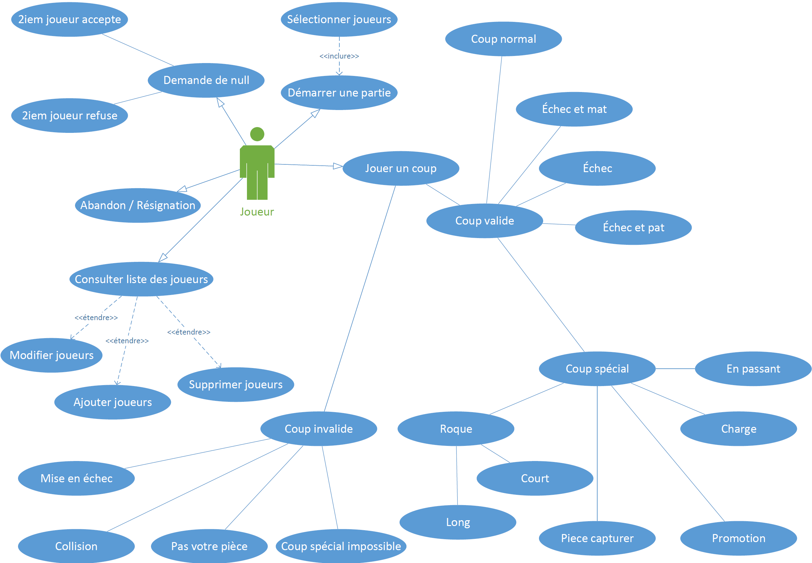
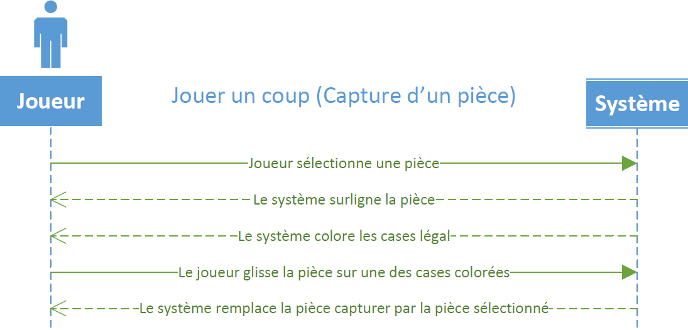

# Programmation 4 - Projet de session

[Énoncé](Consignes/420-C46-H2023_TP1.doc)

## Documentation

### 1. [Cas d'utilisation (Survol)](Documentation/Cas%20d'utilisation.pdf)

### 2. [Cas d'utilisation (Détaillé)](Documentation/Cas%20d'utilisation%20détaillé.pdf)

### 3. [Diagramme de classe](Documentation/Diagramme%20de%20classes.png)

### 4. [Diagramme de séquence](Documentation/Diagramme%20de%20s%C3%A9quence.pdf)
